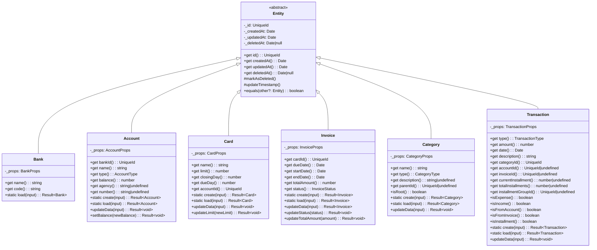
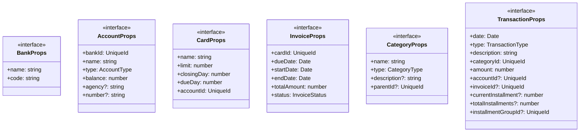

```mermaid
classDiagram
    %% Herança da classe Entity
    Entity <|-- Bank
    Entity <|-- Account
    Entity <|-- Card
    Entity <|-- Invoice
    Entity <|-- Category
    Entity <|-- Transaction

    class Entity {
        <<abstract>>
        -_id: UniqueId
        -_createdAt: Date
        -_updatedAt: Date
        -_deletedAt: Date|null
        +get id(): UniqueId
        +get createdAt(): Date
        +get updatedAt(): Date
        +get deletedAt(): Date|null
        #markAsDeleted()
        #updateTimestamp()
        +equals(other?: Entity): boolean
    }

    class Bank {
        -_props: BankProps
        +get name(): string
        +get code(): string
        +static load(input): Result~Bank~
    }

    class Account {
        -_props: AccountProps
        +get bankId(): UniqueId
        +get name(): string
        +get type(): AccountType
        +get balance(): number
        +get agency(): string|undefined
        +get number(): string|undefined
        +static create(input): Result~Account~
        +static load(input): Result~Account~
        +updateData(input): Result~void~
        +setBalance(newBalance): Result~void~
    }

    class Card {
        -_props: CardProps
        +get name(): string
        +get limit(): number
        +get closingDay(): number
        +get dueDay(): number
        +get accountId(): UniqueId
        +static create(input): Result~Card~
        +static load(input): Result~Card~
        +updateData(input): Result~void~
        +updateLimit(newLimit): Result~void~
    }

    class Invoice {
        -_props: InvoiceProps
        +get cardId(): UniqueId
        +get dueDate(): Date
        +get startDate(): Date
        +get endDate(): Date
        +get totalAmount(): number
        +get status(): InvoiceStatus
        +static create(input): Result~Invoice~
        +static load(input): Result~Invoice~
        +updateData(input): Result~Invoice~
        +updateStatus(status): Result~void~
        +updateTotalAmount(amount): Result~void~
    }

    class Category {
        -_props: CategoryProps
        +get name(): string
        +get type(): CategoryType
        +get description(): string|undefined
        +get parentId(): UniqueId|undefined
        +isRoot(): boolean
        +static create(input): Result~Category~
        +static load(input): Result~Category~
        +updateData(input): Result~void~
    }

    class Transaction {
        -_props: TransactionProps
        +get type(): TransactionType
        +get amount(): number
        +get date(): Date
        +get description(): string
        +get categoryId(): UniqueId
        +get accountId(): UniqueId|undefined
        +get invoiceId(): UniqueId|undefined
        +get currentInstallment(): number|undefined
        +get totalInstallments(): number|undefined
        +get installmentGroupId(): UniqueId|undefined
        +isExpense(): boolean
        +isIncome(): boolean
        +isFromAccount(): boolean
        +isFromInvoice(): boolean
        +isInstallment(): boolean
        +static create(input): Result~Transaction~
        +static load(input): Result~Transaction~
        +updateData(input): Result~void~
    }
```

```mermaid
classDiagram
    %% Interfaces Props
    class BankProps {
        <<interface>>
        +name: string
        +code: string
    }

    class AccountProps {
        <<interface>>
        +bankId: UniqueId
        +name: string
        +type: AccountType
        +balance: number
        +agency?: string
        +number?: string
    }

    class CardProps {
        <<interface>>
        +name: string
        +limit: number
        +closingDay: number
        +dueDay: number
        +accountId: UniqueId
    }

    class InvoiceProps {
        <<interface>>
        +cardId: UniqueId
        +dueDate: Date
        +startDate: Date
        +endDate: Date
        +totalAmount: number
        +status: InvoiceStatus
    }

    class CategoryProps {
        <<interface>>
        +name: string
        +type: CategoryType
        +description?: string
        +parentId?: UniqueId
    }

    class TransactionProps {
        <<interface>>
        +date: Date
        +type: TransactionType
        +description: string
        +categoryId: UniqueId
        +amount: number
        +accountId?: UniqueId
        +invoiceId?: UniqueId
        +currentInstallment?: number
        +totalInstallments?: number
        +installmentGroupId?: UniqueId
    }
```
