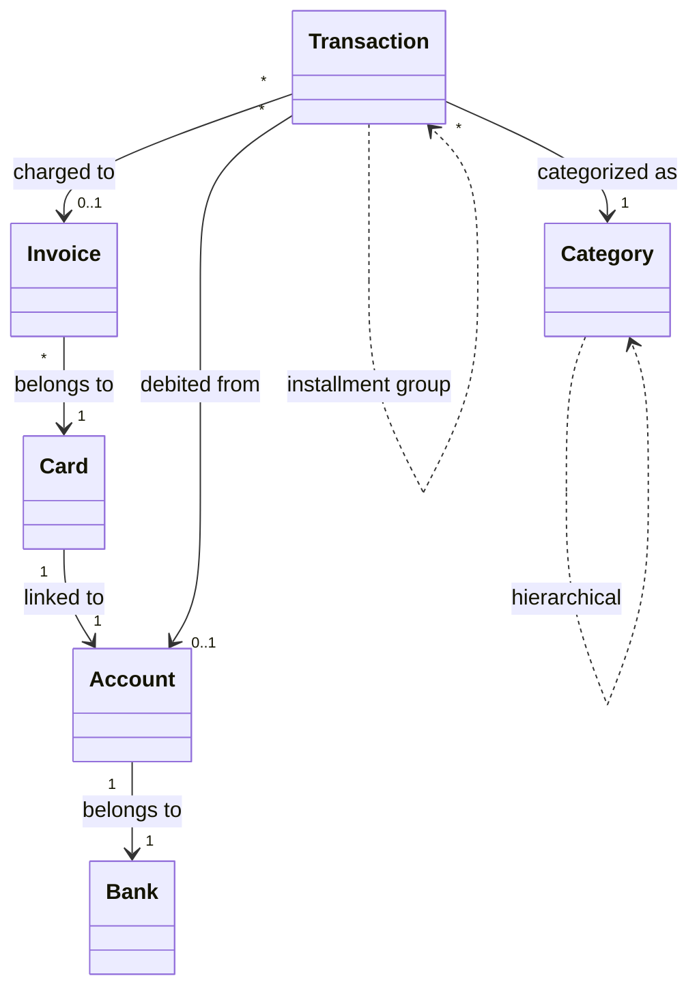

```mermaid
classDiagram
%% Main Entities
class Bank
class Account
class Card
class Invoice
class Category
class Transaction

    %% Main Relationships
    Account "1" --> "1" Bank : belongs to
    Card "1" --> "1" Account : linked to
    Invoice "*" --> "1" Card : belongs to
    Transaction "*" --> "0..1" Account : debited from
    Transaction "*" --> "0..1" Invoice : charged to
    Transaction "*" --> "1" Category : categorized as
    Category ..> Category : hierarchical
    Transaction ..> Transaction : installment group
```
