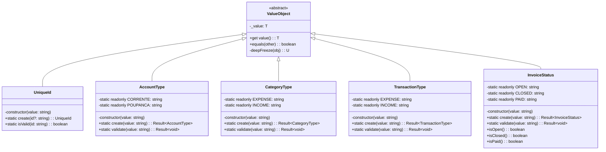

```mermaid
classDiagram
    ValueObject <|-- UniqueId
    ValueObject <|-- AccountType
    ValueObject <|-- CategoryType
    ValueObject <|-- TransactionType
    ValueObject <|-- InvoiceStatus

    class ValueObject {
        <<abstract>>
        -_value: T
        +get value(): T
        +equals(other): boolean
        -deepFreeze(obj): U
    }

    class UniqueId {
        -constructor(value: string)
        +static create(id?: string): UniqueId
        +static isValid(id: string): boolean
    }

    class AccountType {
        -static readonly CORRENTE: string
        -static readonly POUPANCA: string
        -constructor(value: string)
        +static create(value: string): Result~AccountType~
        +static validate(value: string): Result~void~
    }

    class CategoryType {
        -static readonly EXPENSE: string
        -static readonly INCOME: string
        -constructor(value: string)
        +static create(value: string): Result~CategoryType~
        +static validate(value: string): Result~void~
    }

    class TransactionType {
        -static readonly EXPENSE: string
        -static readonly INCOME: string
        -constructor(value: string)
        +static create(value: string): Result~TransactionType~
        +static validate(value: string): Result~void~
    }

    class InvoiceStatus {
        -static readonly OPEN: string
        -static readonly CLOSED: string
        -static readonly PAID: string
        -constructor(value: string)
        +static create(value: string): Result~InvoiceStatus~
        +static validate(value: string): Result~void~
        +isOpen(): boolean
        +isClosed(): boolean
        +isPaid(): boolean
    }
```
